# RecoverOS

> **AI-Native Revenue Recovery Operating System**  
> *Detects revenue at risk, diagnoses the root failure cause, selects bounded recovery interventions, executes actions under deterministic policy guardrails, and measures the resulting revenue outcome.*

[]()
[]()
[]()
[]()
[]()

---

## Executive Summary

- **Buildathon Track**: Razorpay AI Buildathon 2026 — AI Revenue Recovery
- **Category**: Autonomous Revenue Recovery & Payment Operations Operating System
- **Core Paradigm**: Hybrid Architecture — *AI provides diagnostic intelligence, while a deterministic backend policy engine provides control, safety, and operational boundaries.*

---

## 1. The Problem

Digital commerce and subscription businesses lose substantial revenue to payment failures and checkout abandonment. Traditional recovery approaches suffer from fundamental structural flaws:

1. **Blind, Blanket Retries**: Gateways often retry failed transactions without diagnosing why the transaction failed (e.g., retrying hard-declined or reported stolen cards, which increases unnecessary processing overhead and security exposure).
2. **Customer Dunning Fatigue**: Generic notifications sent without frequency caps irritate customers, increasing churn and unsubscribe rates.
3. **Lack of Risk-Adjusted Prioritization**: High-value transactions receive the same automated treatment as micro-transactions, lacking human oversight for high-exposure recoveries.
4. **Unmeasured Financial Outcomes**: Analytics dashboards show aggregate failure counts, but rarely provide transaction-level financial attribution proving which specific intervention recovered which dollar.

---

## 2. The Solution

**RecoverOS** operates as a closed-loop operational decision and execution engine:

```
[ Revenue Event ] (Failed Payment / Abandoned Cart)
        ↓
[ Risk Detection & Ingestion ]
        ↓
[ Deterministic Scoring (ROS 0–100) ]
        ↓
[ AI Diagnosis & Action Selection ] (Google Gemini / FallbackEngine)
        ↓
[ Policy Guardrail Engine ] (Strict Precedence & Safety Rules)
   ├── APPROVE ───────────→ [ Bounded Execution ]
   ├── MODIFY (Escalate) ──→ [ Human-in-the-Loop Queue ]
   └── REJECT (Hard Stop) ─→ [ Terminate Recovery ]
        ↓
[ Observation & Seeded Simulation ]
        ↓
[ Financial Attribution Engine ] (Dynamically Computed Recovered Revenue)
        ↓
[ Append-Only Audit Ledger ]
```

---

## 3. Why This Is Different

| Traditional Recovery Tools | RecoverOS Operating System |
| :--- | :--- |
| **Static cron-based retries** | **Dynamic intervention selection** based on failure code, customer tier, and history |
| **Unbounded automation** | **Strict deterministic policy guardrails** sitting between AI decisions and execution |
| **No human escalation** | **Human-in-the-loop authorization** for high-value transactions ($\ge \text{₹}50,000$) |
| **Hard-stop violations** | **Zero-score hard stops** on fraud (`FRAUD_SUSPECTED`, `CARD_STOLEN`, `ACCOUNT_CLOSED`) |
| **Vague attribution** | **Transaction-level financial attribution** and heuristic attainment tracking |
| **Opaque logs** | **Append-only application audit ledger** with structured JSON payloads |

---

## 4. How RecoverOS Works

### A. Revenue Event Ingestion
When a transaction fails (`BANK_TIMEOUT`, `INSUFFICIENT_FUNDS`, `AUTHENTICATION_FAILED`) or a checkout is abandoned (`CART_ABANDONED`), RecoverOS ingests the event and creates an active `RecoveryCase` record.

### B. Recovery Opportunity Score (ROS 0–100)
A deterministic heuristic score ($0 \le \text{ROS} \le 100$) evaluating 5 weighted dimensions:

$$\text{ROS} = \text{round}\Big(0.30 \times F_{\text{recoverability}} + 0.25 \times C_{\text{reliability}} + 0.15 \times A_{\text{fatigue}} + 0.15 \times T_{\text{amount}} + 0.15 \times R_{\text{recency}}\Big)$$

- **$F_{\text{recoverability}}$**: Bank timeout ($95$), Cart abandoned ($80$), Auth failure ($75$), Insufficient funds ($50$), Hard-prohibited codes ($0$), Default ($20$).
- **$C_{\text{reliability}}$**: Customer historical successes ($\ge 5 \to 100$, $\ge 2 \to 75$, $1 \to 50$, $\ge 3\text{ failures with }0\text{ successes} \to 10$, Default $\to 40$).
- **$A_{\text{fatigue}}$**: Prior attempts ($0 \text{ attempts} \to 100$, $1 \text{ attempt} \to 40$, $\ge 2 \to 0$).
- **$T_{\text{amount}}$**: Value bands ($\text{₹}1\text{k}–\text{₹}15\text{k} \to 90$, $\text{₹}500–\text{₹}1\text{k} \to 70$, $\text{₹}15\text{k}–\text{₹}50\text{k} \to 60$, $\ge \text{₹}50\text{k} \to 30$, $< \text{₹}500 \to 50$).
- **$R_{\text{recency}}$**: Elapsed hours ($\le 1\text{h} \to 100$, $\le 6\text{h} \to 75$, $\le 24\text{h} \to 40$, $> 24\text{h} \to 15$).

> **Critical Safety Semantic**: Hard-prohibited failure codes (`FRAUD_SUSPECTED`, `CARD_STOLEN`, `CARD_LOST`, `ACCOUNT_CLOSED`, `DO_NOT_HONOR_PERMANENT`) strictly receive $\text{ROS} = 0$.

### C. AI Diagnosis & Intervention Selection
The AI diagnostic service analyzes the failure context to output structured recovery instructions:
- **`diagnosisCategory`**: Normalized classification (`TEMPORARY_PAYMENT_FAILURE`, `AUTHENTICATION_FAILURE`, `FRAUD_RISK`, etc.).
- **`rootCauseAnalysis`**: Human-readable explanation of why the failure occurred.
- **`recommendedAction`**: Action choice (`RETRY_PAYMENT`, `SEND_PAYMENT_REMINDER`, `SEND_CHECKOUT_REMINDER`, `SUGGEST_ALTERNATE_PAYMENT`, `ESCALATE_TO_HUMAN`, `STOP_RECOVERY`).
- **`confidence`**: Numeric confidence score ($0.0 \le c \le 1.0$).
- **`customerMessage`**: Tailored communication template and CTA channel (`EMAIL`, `SMS`, `WHATSAPP`).

### D. Policy Guardrail Engine
AI recommendations **never** execute directly. The policy engine evaluates proposed actions against 7 deterministic rules in strict precedence order:

1. **Recovery Window SLA**: Cases older than 48 hours are rejected and transitioned to `STOPPED`.
2. **Hard-Prohibited Failure Block**: Fraud or closed account codes are rejected and halted immediately ($\text{ROS} = 0$, `STOP_RECOVERY`).
3. **Payment Retry Ceiling**: Max 2 retry attempts per case. Subsequent retries are modified to `SUGGEST_ALTERNATE_PAYMENT`.
4. **Customer Contact Ceiling**: Max 2 customer notifications per case to prevent dunning fatigue.
5. **High-Value Threshold**: Transactions $\ge \text{₹}50,000$ are modified to `ESCALATE_TO_HUMAN` for manual operator authorization.
6. **Low Confidence Threshold**: AI confidence $< 0.65$ triggers human review.
7. **Default Approval**: If all guardrails pass, the action is marked `APPROVE`.

### E. Execution Safety & Idempotency
Execution occurs through bounded retry loops (maximum 2 attempts). Each step enforces a composite idempotency key (`caseId:workflowStep:attemptNumber:actionType`) preventing duplicate execution or duplicate financial attribution.

### F. Financial Attribution & Audit
When a simulated recovery action succeeds, the recovered revenue is dynamically attributed to the case (`recoveredAmount = amount`). Every state change, policy decision, and action outcome is recorded in the append-only application audit ledger.

---

## 5. System Architecture

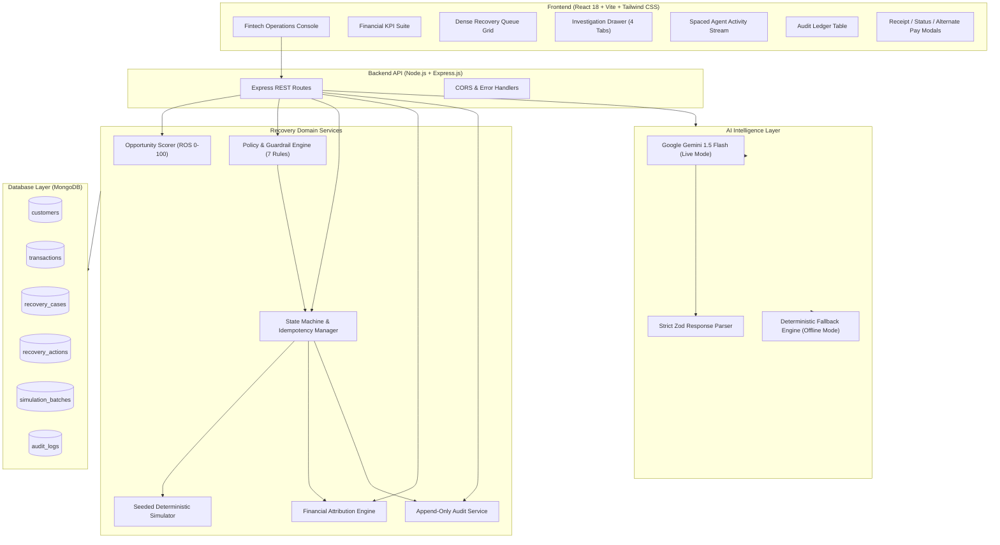

---

## 6. Recovery Decision Flow

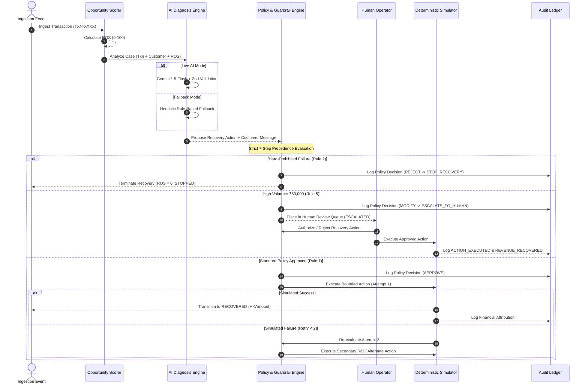

---

## 7. Policy Guardrails vs. Execution Safety

### Policy Decision Rules (Strict Precedence)

| Precedence | Guardrail Rule | Condition | Policy Decision | Rationale |
| :---: | :--- | :--- | :---: | :--- |
| **1** | **Recovery Window SLA** | $\Delta t > 48\text{ hours}$ | `REJECT` $\to$ `STOP_RECOVERY` | Recovery yields decline sharply beyond 48 hours. |
| **2** | **Hard-Prohibited Failure** | `FRAUD_SUSPECTED`, `CARD_STOLEN`, `ACCOUNT_CLOSED`, etc. | `REJECT` $\to$ `STOP_RECOVERY` | Automated recovery on compromised instruments is prohibited. |
| **3** | **Payment Retry Ceiling** | $\text{Retries} \ge 2$ | `MODIFY` $\to$ `SUGGEST_ALTERNATE_PAYMENT` | Prevents repeated processing failures on the same rail. |
| **4** | **Customer Contact Ceiling** | $\text{Contacts} \ge 2$ | `REJECT` $\to$ `STOP_RECOVERY` | Protects customer trust and prevents notification fatigue. |
| **5** | **High-Value Threshold** | $\text{Amount} \ge \text{₹}50,000$ | `MODIFY` $\to$ `ESCALATE_TO_HUMAN` | Requires human operator authorization before execution. |
| **6** | **Confidence Gate** | $\text{Confidence} < 0.65$ | `MODIFY` $\to$ `ESCALATE_TO_HUMAN` | Escalates ambiguous AI decisions to human domain experts. |
| **7** | **Default Approval** | All constraints met | `APPROVE` | Permits bounded automated execution. |

### Execution Safety & Idempotency Controls

- **Idempotency Key Lock**: Enforces unique key (`caseId:workflowStep:attemptNumber:actionType`) to prevent duplicate execution.
- **Bounded Retry Ceiling**: Hard cutoff at 2 attempts per case.
- **Duplicate Attribution Guard**: Financial calculations only credit cases in terminal `RECOVERED` state once.

---

## 8. AI Architecture & Dual-Mode Engine

RecoverOS implements a **Dual-Mode AI Engine** designed for reliability and demo reproducibility:

```
                  ┌────────────────────────────────────────┐
                  │          AI Diagnostic Layer           │
                  └──────────────────┬─────────────────────┘
                                     │
                    ┌────────────────┴────────────────┐
                    ▼                                 ▼
         [ Live AI Mode: Live ]            [ Fallback Mode: Default ]
         • Google Gemini 1.5 Flash          • Zero external API dependency
         • 3,500ms timeout guardrail        • Sub-millisecond execution
         • Strict Zod Schema validation     • 100% deterministic reproducibility
         • Auto-fallback on API fail        • Complete structured JSON output
```

### Why Dual-Mode Matters for Hackathons & Demos:
1. **Zero External Dependency**: When running offline or without an API key, the system executes using the deterministic `FallbackEngine`.
2. **Strict Schema Contracts**: Gemini responses are parsed and validated via Zod (`AIDiagnosisSchema`). If an LLM returns malformed JSON, the engine automatically catches the error and falls back seamlessly.

---

## 9. Deterministic Simulator

To evaluate recovery strategies without moving real money or interacting with live banking APIs, RecoverOS includes a **Seeded Deterministic Simulator**:

- **Reproducible Outcomes**: Uses a deterministic MD5 hash for reproducible simulation outcomes:
  $$\text{Hash} = \text{MD5}\big(\text{SIMULATION\_SEED} : \text{caseId} : \text{actionType} : \text{attemptNumber} : \text{v3}\big)$$
- **Calibrated Success Modifiers**: Incorporates failure code multipliers (e.g., Bank Timeout retry has higher recoverability than Insufficient Funds).
- **Synthetic Dataset**: 100 realistic cases across diverse error codes, customer tiers, and value bands ($\text{₹}499$ to $\text{₹}82,000$).
- **No Real Money Movement**: Offline-capable simulation of recovery workflows.

---

## 10. Financial Metrics & Attribution

All metrics displayed on the console are **dynamically computed from MongoDB database records**:

| Metric | Calculation | Purpose |
| :--- | :--- | :--- |
| **Initial Revenue at Risk** | $\sum \text{initialRevenueAtRisk}$ | Total gross exposed revenue across all 100 cases. |
| **Recovered Revenue** | $\sum \text{recoveredAmount} \text{ where state = 'RECOVERED'}$ | Actual revenue saved by completed recovery actions. |
| **Remaining Exposure** | $\text{Initial at Risk} - \text{Recovered Revenue}$ | Unrecovered revenue currently remaining. |
| **Recovery Rate** | $\frac{\text{Recovered Revenue}}{\text{Initial Revenue at Risk}} \times 100$ | Percentage of exposed revenue successfully recovered. |
| **Expected Recovery** | $\sum (\text{initialRevenueAtRisk} \times \frac{\text{ROS}}{100})$ | Mathematical expectation based on pre-execution ROS scores. |
| **Recovery Attainment** | $\frac{\text{Recovered Revenue}}{\text{Expected Recovery}} \times 100$ | Compares realized recovered revenue against the heuristic expectation. |

### Reference Deterministic Demo Snapshot
*(Generated from the current seeded synthetic dataset of 100 cases)*

- **Initial Revenue at Risk**: **₹10,67,251**
- **Recovered Revenue**: **₹7,43,323** (75 recovered cases)
- **Recovery Rate**: **69.65%**
- **Expected Recovery**: **₹6,91,478**
- **Recovery Attainment**: **107.5%** *(realized recovery exceeded heuristic expectation)*
- **Escalated Cases (Held for Human)**: **4 cases**
- **Stopped Cases (Policy Blocked / Terminal)**: **21 cases**

---

## 11. Human-in-the-Loop Workflow

RecoverOS enforces human governance for high-value recoveries ($\ge \text{₹}50,000$):

1. **Detection**: Policy Rule #5 intercepts transactions meeting or exceeding $\text{₹}50,000$.
2. **State Transition**: Case transitions to `ESCALATED` and halts automated execution.
3. **Customer Safeguard**: Customer message displays a neutral "Under Review" notice with no false retry promises.
4. **Authorization Interface**: Operators review the case in the **High-Value Authorization Modal**, evaluating ROS score factors, failure reasons, and AI recommendations.
5. **Execution**: Clicking **"Authorize Action"** dispatches the simulated action, transitions the case to `RECOVERED`, and logs an audit record with `actor: "HUMAN"`.

---

## 12. Append-Only Application Audit Ledger

Every operational decision and state change is recorded in the `audit_logs` collection:

- **`timestamp`**: ISO 8601 IST timestamp.
- **`actor`**: `SYSTEM`, `AI_AGENT`, `POLICY_ENGINE`, `SIMULATOR`, or `HUMAN`.
- **`transactionId` & `caseId`**: References to transaction and recovery case entities.
- **`event`**: Workflow event (`DIAGNOSIS_COMPLETED`, `POLICY_EVALUATED`, `ACTION_EXECUTED`, `HUMAN_APPROVAL_GRANTED`, `REVENUE_RECOVERED`, `CASE_STOPPED`).
- **`reason`**: Explicit policy rule or technical rationale.
- **`financialImpact`**: Money recovered and credited ($\text{₹}X$).
- **`payload`**: Structured JSON state capturing the full decision snapshot.

---

## 13. Technology Stack

### Frontend
- **Framework**: React 18.3.1 + Vite 6.0.7
- **Styling**: Tailwind CSS 3.4.17 (Custom neutral fintech design tokens)
- **Typography**: Geist (Primary UI font) + JetBrains Mono (Financials & IDs)
- **Icons**: Lucide React 0.474.0
- **Data Visualization**: Recharts 2.15.0
- **HTTP Client**: Axios 1.7.9

### Backend
- **Runtime**: Node.js v20+ (ES Modules)
- **Framework**: Express.js 4.21.2
- **Database ODM**: Mongoose 8.9.5 (MongoDB)
- **Validation**: Zod 3.24.1 (Strict schema validation)
- **Middleware**: CORS 2.8.5, Dotenv 16.4.7

### AI & Simulation
- **LLM Integration**: Google Gemini 1.5 Flash (`gemini-1.5-flash` endpoint via REST)
- **Fallback Engine**: Deterministic heuristic engine
- **Simulator**: MD5 hash-based deterministic outcome resolver

---

## 14. Project Structure

```
RecoverOS/
├── client/                               # Frontend Single Page Application
│   ├── src/
│   │   ├── components/
│   │   │   ├── activity/                 # Spaced Agent Activity Feed
│   │   │   ├── audit/                    # Audit Ledger & JSON Payload Modal
│   │   │   ├── common/                   # Badges, Modals, Drawers, ScorePills
│   │   │   ├── dashboard/                # KPI Cards, Funnel, Recharts Charts
│   │   │   ├── detail/                   # Case Inspector, Score Breakdown, Customer Modals
│   │   │   ├── layout/                   # AppShell, TopHeader, Static Sidebar
│   │   │   └── queue/                    # Dense Queue Table, State Filters, Why Not Retry
│   │   ├── services/                     # Axios REST API Client
│   │   ├── utils/                        # Formatters (INR, Date), Constants, Badges
│   │   ├── App.jsx                       # Main Controller & Tab Manager
│   │   └── index.css                     # Design System Tokens (Light & Dark Charcoal)
│   ├── index.html                        # HTML5 Shell with Geist Font Imports
│   ├── tailwind.config.js                # Tailwind Palette & Spacing Config
│   └── package.json
│
├── server/                               # Backend Modular Monolith API
│   ├── src/
│   │   ├── config/                       # DB Connection, Env Config, Constants
│   │   ├── controllers/                  # Express Route Controllers
│   │   ├── middleware/                   # Error Handlers, CORS
│   │   ├── models/                       # Mongoose Schemas (6 Indexed Collections)
│   │   ├── routes/                       # REST API Route Declarations
│   │   ├── schemas/                      # Zod Validation Schemas
│   │   ├── scripts/                      # Seed Scripts, Determinism Tests, QA Verifiers
│   │   └── services/
│   │       ├── ai/                       # Gemini Agent, Prompt Builder, Fallback Engine
│   │       ├── analytics/                # Financial Attribution & KPI Rollups
│   │       ├── audit/                    # Append-Only Audit Logging Service
│   │       ├── policy/                   # Policy Precedence Engine & "Why Not Retry?"
│   │       ├── scoring/                  # Opportunity Scorer (ROS 0-100 Algorithm)
│   │       ├── simulation/               # Batch Orchestrator, Seed Generator, Simulator
│   │       └── workflow/                 # State Machine, Idempotency Manager, Workflow Engine
│   ├── server.js                         # Express Server Entry Point
│   └── package.json
│
├── docs/
│   └── screenshots/                      # Verification Screenshots & Asset Gallery
├── .env.example                          # Environment Variables Template
├── .gitignore                            # Secret & Artifact Exclusion Rules
├── README.md                             # Comprehensive Technical Documentation
└── package.json                          # Root Scripts & Monorepo Orchestration
```

---

## 15. Local Setup & Installation

### Prerequisites
- **Node.js**: v20.0.0 or higher
- **MongoDB**: Local MongoDB instance running on `mongodb://127.0.0.1:27017` (or MongoDB Atlas URI)
- **Package Manager**: `npm`

### Step 1: Clone Repository
```bash
git clone <repository-url>
cd RecoverOS
```

### Step 2: Install Dependencies
```bash
# Installs root, backend, and frontend dependencies
npm run install:all
```

### Step 3: Configure Environment Variables
Create `server/.env` using `.env.example`:
```bash
cp .env.example server/.env
```

Edit `server/.env`:
```env
PORT=5000
NODE_ENV=development
MONGO_URI=mongodb://127.0.0.1:27017/recoveros
GEMINI_API_KEY=your_gemini_api_key_here  # Optional: Leave blank to use FallbackEngine
CLIENT_URL=http://localhost:5173
AI_TIMEOUT_MS=3500
AI_MODE=deterministic                   # 'live' or 'deterministic'
SIMULATION_SEED=RECOVEROS_BUILDATHON_2026
```

### Step 4: Run Determinism & Guardrail Verification Suite
```bash
npm run test:determinism
```
*Validates 100% determinism across 2 passes, fraud hard stops, high-value escalations, human authorizations, and idempotency protection.*

### Step 5: Start Development Servers
```bash
# Terminal 1: Backend Server (Port 5000)
npm run dev:server

# Terminal 2: Frontend Client (Port 5173)
npm run dev:client
```

Open your browser and navigate to: **`http://localhost:5173`**

---

## 16. Environment Variables Reference

| Variable | Description | Default / Example |
| :--- | :--- | :--- |
| `PORT` | Express backend listening port | `5000` |
| `NODE_ENV` | Application runtime environment | `development` |
| `MONGO_URI` | MongoDB database connection string | `mongodb://127.0.0.1:27017/recoveros` |
| `GEMINI_API_KEY` | Google Gemini API Key (for Live AI Mode) | `AIzaSy...` (or blank for Fallback) |
| `CLIENT_URL` | Allowed CORS origin for frontend | `http://localhost:5173` |
| `AI_TIMEOUT_MS` | Max latency ceiling before invoking fallback | `3500` |
| `AI_MODE` | AI execution mode (`live` or `deterministic`) | `deterministic` |
| `SIMULATION_SEED` | Global seed string for deterministic simulator | `RECOVEROS_BUILDATHON_2026` |
| `VITE_API_BASE_URL` | Frontend API client base URL | `http://localhost:5000/api` |

---

## 17. REST API Reference

### Health Check
- **`GET /api/health`**: Returns service status, active AI mode (`live` / `deterministic`), and server timestamp.

### Dashboard Endpoints
- **`GET /api/dashboard/summary`**: Returns dynamically computed financial rollups, cases by state, pipeline funnel, expected vs. actual metrics, and failure category breakdown.

### Recovery Case Endpoints
- **`GET /api/recovery-cases`**: Paginated list of recovery cases with query filters (`state`, `search`, `minScore`, `limit`).
- **`GET /api/recovery-cases/:id`**: Full inspection detail for a single recovery case, including customer profile, score factors, actions, and timeline.
- **`GET /api/recovery-cases/:id/why-not-retry`**: Explainability endpoint returning explicit policy guardrail reasons why retries were blocked.
- **`POST /api/recovery-cases/:id/action`**: Executes human authorization (`APPROVE_ESCALATION` / `REJECT_ESCALATION`).
- **`POST /api/recovery-cases/:id/analyze`**: Runs single-case diagnostic analysis and bounded workflow execution.

### Simulation Endpoints
- **`POST /api/simulation/batch-run`**: Triggers batch execution of all 100 cases (`mode: "ANIMATED"` or `"FAST"`).
- **`GET /api/simulation/batch/:batchId/status`**: Polling endpoint for running simulation batches.
- **`POST /api/simulation/reset`**: Resets the entire MongoDB database to clean initial `AT_RISK` seed dataset.

### Audit & Activity Endpoints
- **`GET /api/audit-logs`**: Immutable audit logs with actor filtering (`ALL`, `AI_AGENT`, `POLICY_ENGINE`, `SIMULATOR`, `HUMAN`).
- **`GET /api/audit-logs/activity`**: Chronological operational event feed for the Agent Activity Stream.

---

## 18. 5-Minute Judge Demo Flow

Follow these steps for a complete evaluation of RecoverOS:

1. **Clean Reset**: Click **"Reset Demo"** in the top navigation header. Observe the clean initial state: 100 cases at risk, ₹0 recovered, 0% recovery rate.
2. **Execute 100-Case Batch**: Click **"Run Recovery Batch (100)"**. Watch execution banner dynamically process all 100 cases.
3. **Verify Batch Economics**: Observe the KPI cards update to **₹7,43,323 recovered (69.65% recovery rate, 107.5% attainment)** with dynamic Recharts category charts.
4. **Inspect Normal Recoverable Case**: Switch to **Recovery Queue**, filter by **"Recovered"**, and click **"Inspect"** on `TXN-8030` (`BANK_TIMEOUT`). Note the ROS score ($97/100$), AI recommendation (`Retry Payment`), policy approval, and interactive **"View Confirmation"** receipt modal.
5. **Inspect High-Value Human Escalation**: Filter by **"Escalated"**, click **"Inspect"** on `TXN-8017` ($\text{₹}56,447$). Notice how Policy Rule #5 halted automated retries. Click **"Authorize Action"** to approve the recovery and observe the state transition to `RECOVERED`.
6. **Inspect Fraud Hard-Stop**: Filter by **"Stopped"**, click **"Why Not Retry?"** on `TXN-8096` (`FRAUD_SUSPECTED`). Observe how Policy Rule #2 blocked automated recovery with strictly $0/100$ ROS. Click **"Alternate Payment"** to preview the customer checkout fallback.
7. **Verify Audit Trail**: Switch to **Audit Ledger**. Filter by `HUMAN` or `POLICY_ENGINE`, and click the eye icon to view raw JSON audit payloads proving complete auditability.

---

## 19. Visual Gallery & Screenshots

### A. Dark Mode Operations Overview
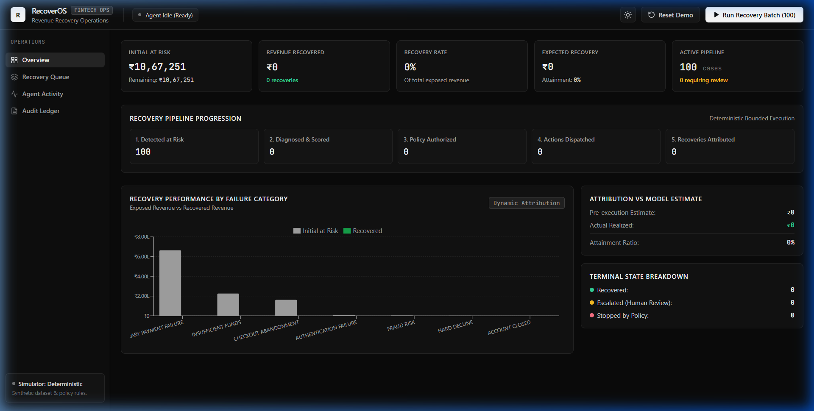

### B. Clean Enterprise Light Mode
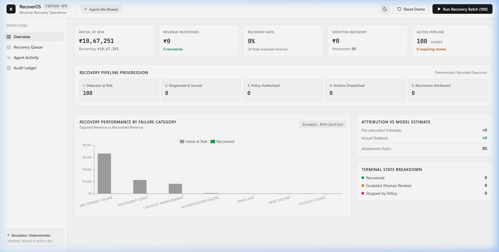

### C. Dense Recovery Queue Data Grid
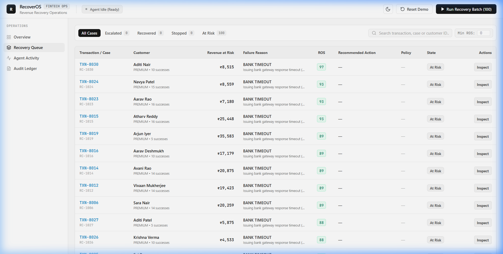

### D. Case Detail Investigation Drawer
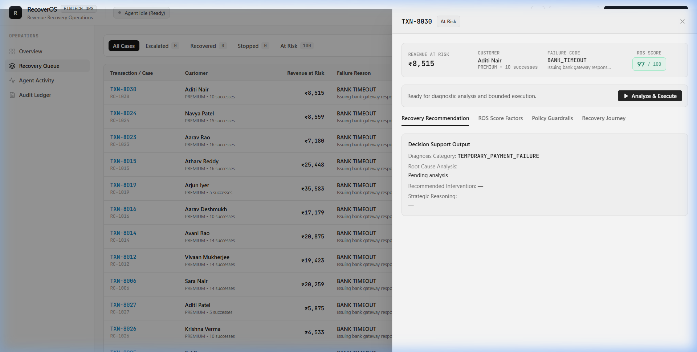

### E. 100-Case Batch Recovery Execution
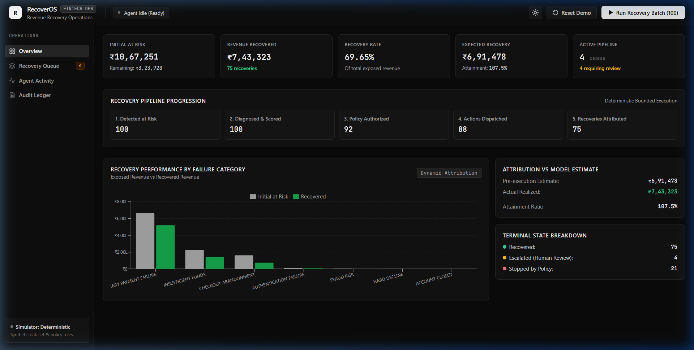

### F. High-Value Authorization & Immutable Audit Trail
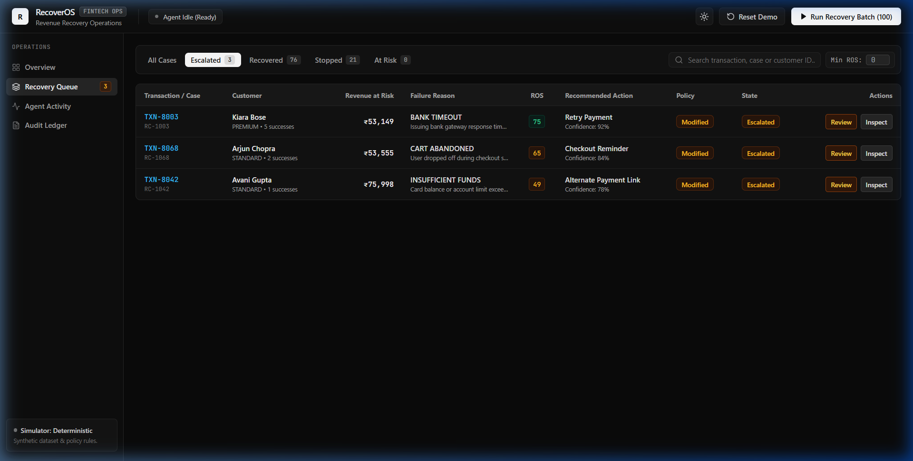
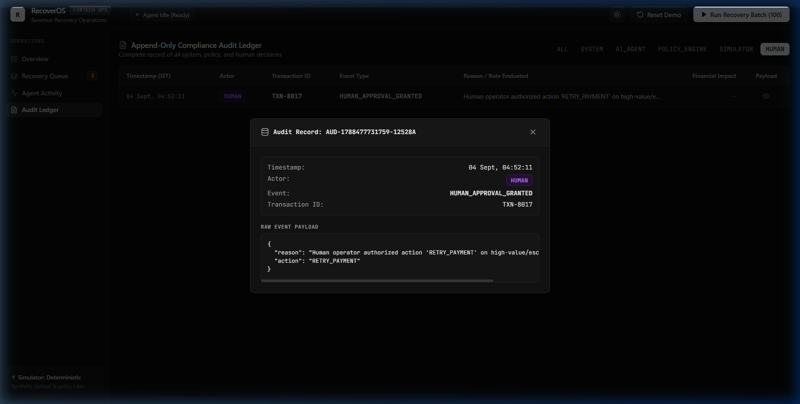
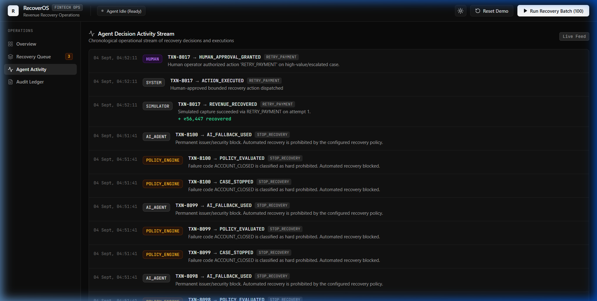

### G. Customer Experience Action Modals
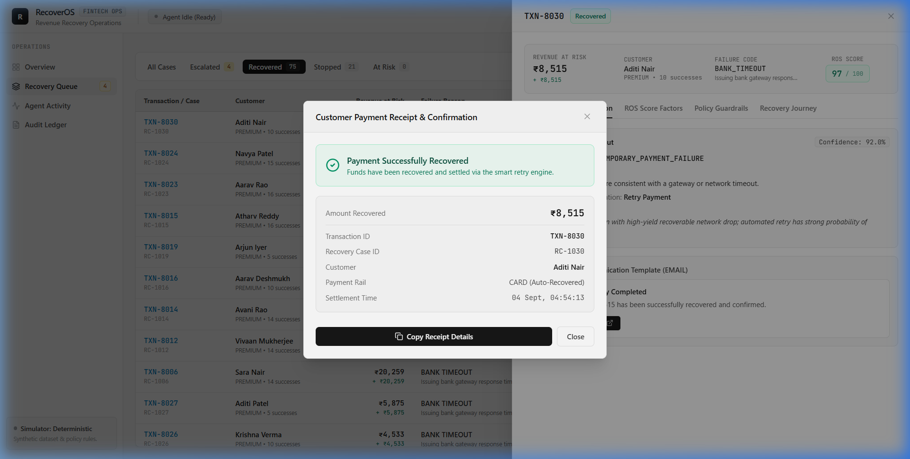
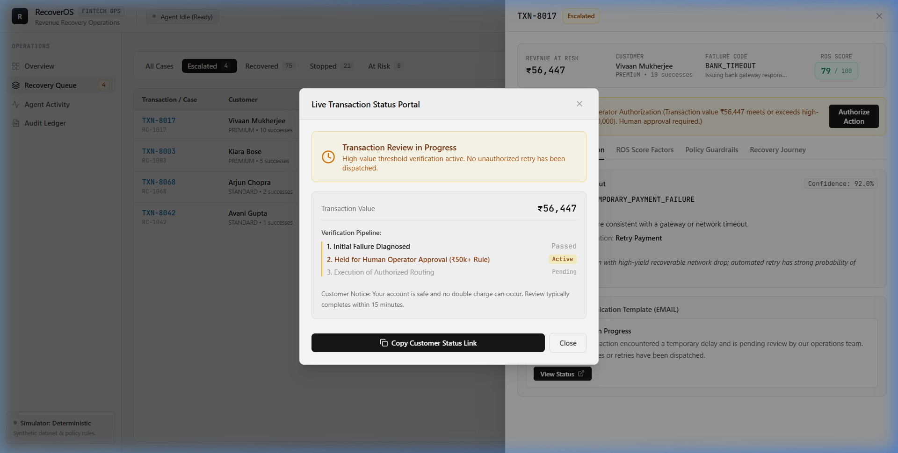


---

## 20. Security & Privacy Safeguards

- **Synthetic Data Only**: All demo transactions, customer names, and IDs are synthetic. No real customer data or PII is stored.
- **No Cardholder Data (PAN/CVV)**: The schema stores only metadata (`paymentMethod: "CARD"`, `last4: "4242"`).
- **Backend Key Isolation**: `GEMINI_API_KEY` is strictly confined to the backend environment and never leaked to the client bundle.
- **Deterministic Bounded Retries**: The policy engine enforces hard ceilings (max 2 retries, max 2 messages, 48-hour SLA) preventing infinite execution loops.
- **Idempotency Protection**: Every execution requires an idempotency key to prevent double execution or race conditions.

---

## 21. Testing & Verification

RecoverOS includes automated verification test suites in `server/src/scripts/`:

```bash
# Run the complete determinism & guardrail verification suite
npm run test:determinism
```

### Verified Test Assertions:
- ✅ **Pass 1 vs. Pass 2 Determinism**: 100% identical financial outcomes across consecutive seed runs.
- ✅ **Scenario 1 (Fraud Hard Stop)**: Prohibited fraud codes (`FRAUD_SUSPECTED`) are blocked with ₹0 recovered.
- ✅ **Scenario 2 (High-Value Escalation)**: Transactions $\ge \text{₹}50,000$ escalate to the human queue.
- ✅ **Scenario 3 (Human Authorization)**: Escalated cases transition to `RECOVERED` upon human approval.
- ✅ **Scenario 4 (Idempotency Lock)**: Duplicate requests are safely blocked from re-execution.
- ✅ **Production Build Verification**: `npm run build:client` compiles with 0 errors.

---

## 22. Limitations & Scope Boundaries

- **Simulated Execution Rails**: The current build uses a seeded deterministic simulator rather than live production payment gateways.
- **Simulated Communication Channels**: SMS, Email, and WhatsApp templates are generated and previewed in interactive modals rather than dispatched via live telephony providers.
- **Configured Policy Thresholds**: Policy parameters (₹50k high-value ceiling, 48h SLA) are configured via system constants rather than a dynamic merchant rule builder UI.

---

## 23. Future Roadmap

1. **Live Gateway Webhook Ingestion**: Ingest live webhook streams from payment gateways with real-time risk scoring.
2. **Merchant Policy Studio**: Visual rule builder allowing finance leads to customize threshold values, retry backoffs, and approval matrices.
3. **Adaptive Intervention Optimization**: Continuously optimize recovery intervention selection based on historical success rates per issuer.
4. **Multi-Rail Smart Routing**: Automatically re-route failed card payments to instant UPI collect requests or WhatsApp payment links.

---

## 24. Buildathon Submission Checklist

- [x] Comprehensive root `README.md` complete and verified
- [x] Local setup and reproduction instructions verified
- [x] `.env.example` template provided without hardcoded secrets
- [x] `.gitignore` verified to exclude `.env`, `node_modules/`, and build artifacts
- [x] Frontend production build compiles cleanly (`npm run build:client` passing)
- [x] Determinism and guardrail test suite verified (`npm run test:determinism` passing)
- [x] 11 high-resolution verification screenshots included in `docs/screenshots/`
- [x] Real-time 5-minute judge demo flow documented step-by-step
- [x] Zero backend business logic, financial formulas, or API contracts modified

---

## License

MIT License. Developed for the **Razorpay AI Buildathon 2026**.
