# RecoverOS

> > **AI-Native Revenue Recovery Operating System**
> *Detects revenue at risk, diagnoses root causes with Grok-2 or a deterministic fallback, selects bounded recovery actions under deterministic policy guardrails, executes safely, and records every decision and recovery outcome in a tamper-evident audit trail.*

[]()
[]()
[]()
[]()
[]()

---

## 📑 Table of Contents
1. [Executive Summary](#executive-summary)
2. [The Core Problem](#1-the-core-problem)
3. [The Solution & Paradigm](#2-the-solution--paradigm)
4. [Why RecoverOS Outperforms Legacy Systems](#3-why-recoveros-outperforms-legacy-systems)
5. [End-to-End System Architecture](#4-end-to-end-system-architecture)
6. [Core Algorithms & Intelligence Engine](#5-core-algorithms--intelligence-engine)
   - [A. Recovery Opportunity Scoring (ROS 0–100)](#a-recovery-opportunity-scoring-ros-0100)
   - [B. AI Diagnosis Layer (xAI Grok-2 & Fallback)](#b-ai-diagnosis-layer-xai-grok-2--fallback)
   - [C. 7-Step Deterministic Policy & Guardrail Engine](#c-7-step-deterministic-policy--guardrail-engine)
   - [D. Execution Safety & Composite Idempotency](#d-execution-safety--composite-idempotency)
7. [Enterprise Features Showcase](#6-enterprise-features-showcase)
   - [A. Multi-Currency Global Conversion Engine](#a-multi-currency-global-conversion-engine)
   - [B. Tamper-Evident SHA-256 Hash-Chained Audit Ledger](#b-tamper-evident-sha-256-hash-chained-audit-ledger)
   - [C. Human-in-the-Loop Governance Matrix](#c-human-in-the-loop-governance-matrix)
   - [D. Responsive & Adaptive Console UI](#d-responsive--adaptive-console-ui)
8. [Visual Showcase & UI Gallery](#7-visual-showcase--ui-gallery)
9. [Mathematical Attribution & Demo Economics](#8-mathematical-attribution--demo-economics)
10. [Technology Stack](#9-technology-stack)
11. [Project Directory Structure](#10-project-directory-structure)
12. [Local Setup & Reproduction Guide](#11-local-setup--reproduction-guide)
13. [Environment Configuration](#12-environment-configuration)
14. [REST API Reference](#13-rest-api-reference)
15. [Security, Governance & Compliance](#15-security-governance--compliance)
16. [Automated Verification & Test Matrix](#16-automated-verification--test-matrix)
17. [Future Roadmap](#17-future-roadmap)

---

## Executive Summary

- **Buildathon Track**: Razorpay AI Buildathon 2026 — AI Revenue Recovery

- **Product Category**: AI-Native Revenue Recovery & Payment Operations

- **Core Paradigm**: **Hybrid AI-Deterministic Architecture** — *xAI Grok (`grok-2-latest`) provides contextual diagnosis and recovery messaging, while deterministic backend services enforce safety boundaries, hard stops, bounded execution, and financial attribution.*

```text
┌─────────────────────────────────────────────────────────────────────────────┐
│                           RecoverOS Workflow                                 │
│                                                                             │
│  [ Revenue Event ]                                                          │
│  Failed Payment / Checkout Abandonment / Invoice Overdue                    │
│           │                                                                 │
│           ▼                                                                 │
│  [ Risk Detection & ROS Scoring ]                                           │
│           │                                                                 │
│           ▼                                                                 │
│  [ AI Diagnosis ] ───────────────► [ Deterministic Fallback ]               │
│           │                                                                 │
│           ▼                                                                 │
│  [ Policy & Guardrail Engine ]                                              │
│           │                                                                 │
│      ┌────┴───────────────┐                                                 │
│      ▼                    ▼                                                 │
│ [ APPROVE / MODIFY ]   [ ESCALATE / STOP ]                                  │
│      │                    │                                                 │
│      └─────────┬──────────┘                                                 │
│                ▼                                                            │
│       [ Bounded Execution ]                                                 │
│                │                                                            │
│                ▼                                                            │
│       [ Outcome & Financial Attribution ]                                   │
│                │                                                            │
│                ▼                                                            │
│       [ Tamper-Evident Audit Trail ]                                        │
└─────────────────────────────────────────────────────────────────────────────┘

---

## 1. The Problem

Revenue leakage does not come from a single failure mode. Payment failures, checkout abandonment, overdue invoices, and repeated unsuccessful recovery attempts can all leave otherwise collectible revenue unresolved.

The operational challenge is deciding:
- which revenue opportunities deserve intervention first,
- why the revenue is at risk,
- which recovery action is appropriate,
- when an action should be stopped or escalated,
- and how to measure the revenue actually recovered.

A recovery system therefore needs more than retry logic or a dashboard. It needs prioritization, contextual diagnosis, deterministic guardrails, bounded execution, and financial attribution.

1. **Blind, Blanket Retries**: Failed payments can be treated uniformly without considering the failure reason, customer history, retry fatigue, transaction value, or whether recovery is still appropriate.

2. **Customer Dunning Fatigue**: Repeated recovery messages without contact limits, customer context, or cooldown controls can result in unnecessary interventions and a poor recovery experience.

3. **High-Value Transactions & Governance**: High-value recovery opportunities require stronger oversight than routine cases. Without a structured escalation path, materially different recovery opportunities can be handled too uniformly.

4. **Opaque Financial Attribution**: Recovery metrics are difficult to operationalize when the system cannot connect a recovery outcome back to the originating transaction, intervention, policy decision, and recovered amount.

---

## 2. The Solution & Paradigm

**RecoverOS** re-architects revenue recovery as a **closed-loop, intelligent decision and execution operating system**:

1. **Deterministic Ingestion & Scoring**: Evaluates incoming revenue-risk events across 5 mathematical dimensions — Recoverability, Customer Reliability, Fatigue Penalty, Amount Tier, and Recency Decay — to produce a deterministic Recovery Opportunity Score (ROS).

2. **LLM Diagnostic Intelligence**: Uses xAI Grok (`grok-2-latest`) to classify failure root causes, recommend recovery strategies, and generate personalized, channel-specific communication copy for Email, SMS, and WhatsApp. AI output is schema-validated before entering the deterministic policy layer.

3. **Deterministic Policy Guardrails**: Sits between AI recommendations and execution, enforcing a strict 7-rule precedence matrix covering recovery-window expiry, hard-prohibited failure conditions, retry/contact limits, high-value cases, low-confidence recommendations, and default approval behavior.

4. **Human-in-the-Loop Authorization**: Routes high-value recoveries (≥ ₹50,000) and low-confidence recommendations into a dedicated operator review queue, requiring explicit human authorization before execution.

5. **Financial Attribution**: Ties recovery outcomes back to individual recovery cases and aggregates them into Initial Revenue at Risk, Recovered Revenue, Remaining Revenue, Expected Recovery, Recovery Rate, Expected Recovery Attainment, and Intervention Efficiency metrics.

6. **Tamper-Evident Audit Trail**: Records decisions, policy evaluations, recovery actions, and financial outcomes in an append-only application audit trail. Audit records are linked through a sequential SHA-256 hash chain, with an integrity-verification endpoint for detecting sequence or hash-chain inconsistencies.

---

## 3. Why-recoveros-outperforms-legacy-systems

| Capability / Feature | Conventional Recovery Approach | RecoverOS Operating System |
| :--- | :--- | :--- |
| **Intervention Strategy** | Rule-based or schedule-driven retries with limited case-level context | **Context-aware action selection** using failure reason, customer history, fatigue, amount, and recency |
| **AI Safety Model** | Limited separation between recommendation and execution | **Bounded Hybrid Model**: AI diagnoses and recommends; deterministic policy rules govern execution |
| **High-Value Controls** | Recovery treatment may not explicitly differentiate by transaction value | **Human-in-the-Loop** escalation for amounts ≥ ₹50,000 |
| **Fraud & Risk Handling** | Recovery behavior depends on configured failure handling | **Hard-stop policy conditions** for `FRAUD_SUSPECTED`, `CARD_STOLEN`, `LOST_CARD`, and other prohibited failure codes |
| **Customer Dunning** | Generic or repeated recovery communication | **Frequency-capped interventions** with contextual, channel-specific messaging |
| **Multi-Currency Support** | Often centered around a single reporting currency | **Multi-Currency Display & Conversion** across INR, USD, EUR, GBP, AED, CAD, SGD, and JPY |
| **Audit & Governance** | Application logs may not provide decision-level traceability | **Tamper-evident SHA-256 hash-chained audit trail** covering decisions, policy evaluations, actions, and outcomes |
| **Operations Console** | Operational visibility may be separated across dashboards and workflows | **Unified Recovery Operations Console** for queue management, agent activity, recovery journeys, and audit inspection |

---

## 4. End-to-End System Architecture

```mermaid
graph TD

    subgraph Client["Frontend Layer — React + Vite + Tailwind CSS"]
        UI["Fintech Operations Console"]
        KPICards["Financial KPI Suite"]
        Queue["Recovery Queue"]
        Drawer["Investigation Drawer"]
        ActivityStream["Agent Activity Stream"]
        AuditTrail["Tamper-Evident Audit Trail"]
        Currency["Currency Display & Conversion Controls"]
        Modals["Recovery / Status / Alternate Payment Modals"]
    end

    subgraph API["Backend API Layer — Node.js + Express"]
        Router["REST Routes"]
        RateLimiter["Tiered Rate Limiting"]
        ApiKeyAuth["API Key Authentication"]
        ZodValidator["Zod Request Validation"]
        ErrorHandler["Normalized Error Handler"]
        Controllers["Route Handlers / Controllers"]
    end

    subgraph Recovery["Recovery Domain Services"]
        Scorer["Opportunity Scorer — ROS 0–100"]
        Policy["Policy & Guardrail Engine — 7 Precedence Rules"]
        Workflow["Workflow State Machine + Idempotency"]
        Executor["Bounded Recovery Execution"]
        Analytics["Financial Attribution & Metrics"]
        Audit["SHA-256 Hash-Chained Audit Service"]
        Simulator["Seeded Deterministic Outcome Simulator"]
    end

    subgraph AI["AI Diagnostic Intelligence"]
        Diagnosis["AI Diagnosis Service"]
        Grok["xAI Grok — grok-2-latest"]
        Fallback["Deterministic Heuristic Fallback"]
        OutputSchema["Zod AI Output Schema"]
    end

    subgraph DB["Persistence Layer — MongoDB"]
        Customers[("customers")]
        Transactions[("transactions")]
        Cases[("recovery_cases")]
        Actions[("recovery_actions")]
        Batches[("simulation_batches")]
        AuditLogs[("audit_logs")]
    end

    UI --> Router

    Router --> RateLimiter
    RateLimiter --> ApiKeyAuth
    ApiKeyAuth --> ZodValidator
    ZodValidator --> Controllers
    Controllers --> ErrorHandler

    Controllers --> Scorer
    Controllers --> Diagnosis
    Controllers --> Workflow
    Controllers --> Analytics
    Controllers --> Audit

    Scorer --> Diagnosis
    Diagnosis --> Grok
    Diagnosis --> Fallback
    Grok --> OutputSchema
    Fallback --> OutputSchema

    OutputSchema --> Policy
    Policy --> Workflow

    Workflow --> Executor
    Workflow --> Simulator
    Executor --> Analytics
    Simulator --> Analytics

    Analytics --> Audit
    Executor --> Audit
    Policy --> Audit
    Workflow --> Audit

    Scorer --> Cases
    Workflow --> Cases
    Executor --> Actions
    Simulator --> Batches
    Analytics --> Transactions
    Audit --> AuditLogs

    Cases --> Customers
    Cases --> Transactions

    CoreServices["Recovery Domain Services"] -.-> DB

---

## 5. Core Algorithms & Intelligence Engine

### A. Recovery Opportunity Scoring (ROS 0–100)

The **Recovery Opportunity Score (ROS)** is a deterministic mathematical heuristic ($0 \le \text{ROS} \le 100$) calculating recoverability across 5 weighted dimensions:

$$\text{ROS} = \text{round}\Big(0.30 \cdot F_{\text{recoverability}} + 0.25 \cdot C_{\text{reliability}} + 0.15 \cdot A_{\text{fatigue}} + 0.15 \cdot T_{\text{amount}} + 0.15 \cdot R_{\text{recency}}\Big)$$

```
┌────────────────────────┬────────────────────────────────────────────────────────────────────────┐
│ Factor                 │ Dimension Values & Calibrated Weights                                 │
├────────────────────────┼────────────────────────────────────────────────────────────────────────┤
│ F_recoverability (30%) │ Bank Timeout (95), Cart Abandoned (80), Auth Failed (75),             │
│                        │ Insufficient Funds (50), Hard Prohibited (0), Default (20)             │
├────────────────────────┼────────────────────────────────────────────────────────────────────────┤
│ C_reliability (25%)    │ Historical Successes: >=5 (100), >=2 (75), 1 (50),                     │
│                        │ >=3 Failures w/ 0 Success (10), Default (40)                          │
├────────────────────────┼────────────────────────────────────────────────────────────────────────┤
│ A_fatigue (15%)        │ Prior Attempts: 0 attempts (100), 1 attempt (40), >=2 attempts (0)     │
├────────────────────────┼────────────────────────────────────────────────────────────────────────┤
│ T_amount (15%)         │ Value Bands: ₹1k–₹15k (90), ₹500–₹1k (70), ₹15k–₹50k (60),             │
│                        │ >=₹50k (30), <₹500 (50)                                                │
├────────────────────────┼────────────────────────────────────────────────────────────────────────┤
│ R_recency (15%)        │ Elapsed Time: <=1h (100), <=6h (75), <=24h (40), >24h (15)             │
└────────────────────────┴────────────────────────────────────────────────────────────────────────┘
```

> **Critical Safety Semantic**: Hard-prohibited failure codes (`FRAUD_SUSPECTED`, `CARD_STOLEN`, `CARD_LOST`, `ACCOUNT_CLOSED`, `DO_NOT_HONOR_PERMANENT`) strictly receive $\text{ROS} = 0$.

---

### B. AI Diagnosis Layer (xAI Grok-2 & Deterministic Fallback)

RecoverOS uses a **Dual-Mode AI Diagnostic Engine** that supports live Grok-based diagnosis while retaining a deterministic fallback for reproducible, offline demonstrations:

```text
                  ┌────────────────────────────────────────┐
                  │          AI Diagnostic Layer           │
                  └──────────────────┬─────────────────────┘
                                     │
                    ┌────────────────┴────────────────┐
                    ▼                                 ▼
         [ Live Mode: xAI Grok ]           [ Deterministic Fallback ]
         • Model: grok-2-latest            • No external AI dependency
         • Structured output               • Deterministic results
         • Zod schema validation            • Reproducible demonstrations
         • 3,500ms timeout guardrail        • Schema-compatible output
         • Automatic fallback on failure
                    │                                 │
                    └────────────────┬────────────────┘
                                     ▼
                         [ Zod Output Validation ]
                                     │
                                     ▼
                         [ Deterministic Policy ]
---

### C. 7-Step Deterministic Policy & Guardrail Engine

AI recommendations are **never executed directly**. The policy engine evaluates each proposed action against 7 deterministic rules in strict precedence order. Higher-priority safety and operational constraints cannot be overridden by the AI recommendation.

```mermaid
sequenceDiagram
    autonumber
    participant AI as AI Diagnosis Engine
    participant Policy as Policy & Guardrail Engine
    participant Queue as Human Review Queue
    participant Exec as Bounded Execution
    participant Audit as Hash-Chained Audit Trail

    AI->>Policy: Proposed Action + Customer Copy
    Note over Policy: Sequential 7-Rule Precedence Evaluation

    alt Rule 1: Recovery Window / Commercial Invoice SLA Expired
        Policy->>Audit: Log REJECT → STOP_RECOVERY
        Policy-->>Exec: Transition Case to STOPPED

    else Rule 2: Hard-Prohibited Failure Code
        Policy->>Audit: Log REJECT → STOP_RECOVERY
        Policy-->>Exec: Terminate Recovery → STOPPED

    else Rule 3: Payment Retry Ceiling Reached (Retries >= 2)
        Policy->>Audit: Log MODIFY → SUGGEST_ALTERNATE_PAYMENT
        Policy->>Exec: Dispatch Alternate Payment Notification

    else Rule 4: Contact Frequency Ceiling Reached (Contacts >= 2)
        Policy->>Audit: Log REJECT → STOP_RECOVERY
        Policy-->>Exec: Halt Customer Communications

    else Rule 5: High-Value Transaction (Amount >= ₹50,000)
        Policy->>Audit: Log MODIFY → ESCALATE_TO_HUMAN
        Policy->>Queue: Enqueue for Operator Review → ESCALATED

    else Rule 6: Low AI Confidence (Confidence < 0.65)
        Policy->>Audit: Log MODIFY → ESCALATE_TO_HUMAN
        Policy->>Queue: Enqueue for Operator Review → ESCALATED

    else Rule 7: Default Policy Approval
        Policy->>Audit: Log APPROVE
        Policy->>Exec: Dispatch Bounded Execution
    end
---

### D. Execution Safety & Composite Idempotency

- **Composite Idempotency Keys**: Formatted as `caseId:workflowStep:attemptNumber:actionType` and enforced through a unique database constraint to prevent duplicate execution under repeated or concurrent requests.

- **Deterministic Retry Ceiling**: Maximum 2 payment retries per case, enforced by the policy layer before execution.

- **Financial Attribution Guard**: Recovery attribution is guarded so that a case entering the terminal `RECOVERED` state does not create duplicate recovered-revenue attribution.

- **Resumable Batch Processing**: Per-case checkpointing using `lastProcessedCaseId` and `checkpointIndex` enables interrupted simulation batches to resume through `POST /api/simulation/batch/:batchId/resume`.

---

## 6. Enterprise Features Showcase

### A. Multi-Currency Display & Conversion

RecoverOS includes a **multi-currency display and conversion layer** accessible through the Settings modal (`⚙️ Settings`).

- **8 Supported Currencies**:
  - `INR` (₹) — Indian Rupee (Base)
  - `USD` ($) — US Dollar ($1 = ₹86.50)
  - `EUR` (€) — Euro (€1 = ₹91.20)
  - `GBP` (£) — British Pound (£1 = ₹109.80)
  - `AED` (AED) — UAE Dirham (1 AED = ₹23.55)
  - `CAD` (CA$) — Canadian Dollar (CA$1 = ₹61.20)
  - `SGD` (S$) — Singapore Dollar (S$1 = ₹64.40)
  - `JPY` (¥) — Japanese Yen (¥1 = ₹0.56)

- **Reference Exchange Rates**: The UI uses configured reference rates for deterministic and consistent demonstration output.

- **Staged Preview & Global Display Update**: Selecting a currency previews the converted values in the Settings modal. Clicking **"Done"** applies the selected currency across supported KPI cards, revenue charts, queue tables, case details, modals, and audit views.

- **Browser Persistence**: The selected currency preference is stored in browser `localStorage` and restored after page reloads.
---

### B. Tamper-Evident SHA-256 Hash-Chained Audit Ledger
Every operational transition and policy evaluation is recorded in the `audit_logs` collection and sealed into an immutable sequential hash chain:

```
Entry #1 (Genesis)              Entry #2                        Entry #3
┌─────────────────────────┐     ┌─────────────────────────┐     ┌─────────────────────────┐
│ PreviousHash: 000...000 │ ┌──►│ PreviousHash: a7f8c9... │ ┌──►│ PreviousHash: e3d2b1... │
│ Timestamp: 21:40:00 IST │ │   │ Timestamp: 21:40:02 IST │ │   │ Timestamp: 21:40:05 IST │
│ Event: CASE_INGESTED    │ │   │ Event: POLICY_APPROVED  │ │   │ Event: REVENUE_RECOVERED│
│ FinancialImpact: ₹0     │ │   │ FinancialImpact: ₹0     │ │   │ FinancialImpact: ₹12,500│
│ EntryHash: a7f8c9...    │─┘   │ EntryHash: e3d2b1...    │─┘   │ EntryHash: 9f4a1c...    │
└─────────────────────────┘     └─────────────────────────┘     └─────────────────────────┘
```

- **Cryptographic Sealing**: Canonical digest seals `timestamp + caseId + actor + event + reason + financialImpact + payload + previousHash`.
- **1-Click UI Verification**: Click **"Verify Chain Integrity"** in the Audit Ledger tab to dynamically traverse all entries and verify cryptographic continuity.
- **REST Verification Endpoint**: `GET /api/audit-logs/verify-chain` returns verification status and count of traversed entries.

---

### C. Human-in-the-Loop Governance Matrix
1. **Automated Interception**: Transactions $\ge \text{₹}50,000$ or cases with AI confidence $< 0.65$ are halted at the policy layer and transitioned to `ESCALATED`.
2. **Review Interface**: Operators inspect the **High-Value Authorization Modal**, evaluating ROS score factors, failure causes, customer tier, and AI recommendations.
3. **Operator Attribution**: Authorizing or rejecting a case records the operator's identity (`operatorId`), timestamp, and notes in the audit log with `actor: "HUMAN"`.

---


## 7. Visual Showcase & UI Gallery


### A. Dark Mode Operations Overview
*Executive KPI suite, Recovery Funnel, Category Loss breakdown, and dynamic revenue metrics in dark charcoal mode.*
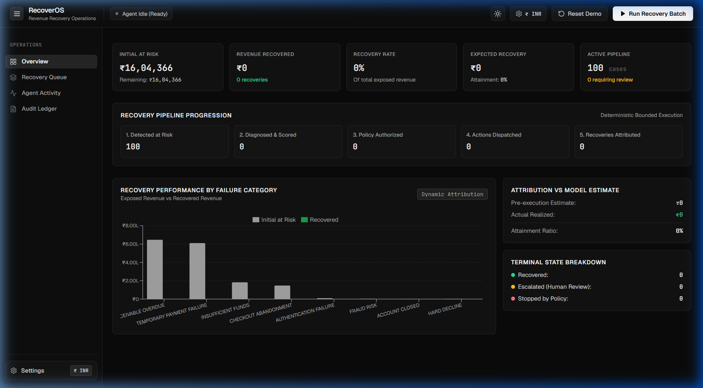

---


### B. Enterprise Clean Light Mode
*High-contrast light mode designed for financial operations teams and daytime workflows.*
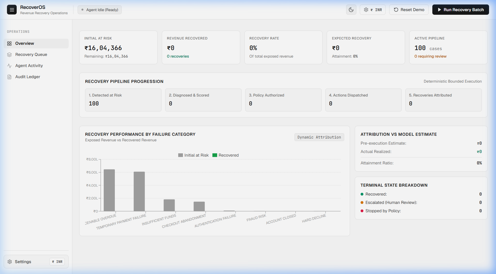

---

### C. Batch In Progress
*Enterprise clean Dark mode with batch in progress.*
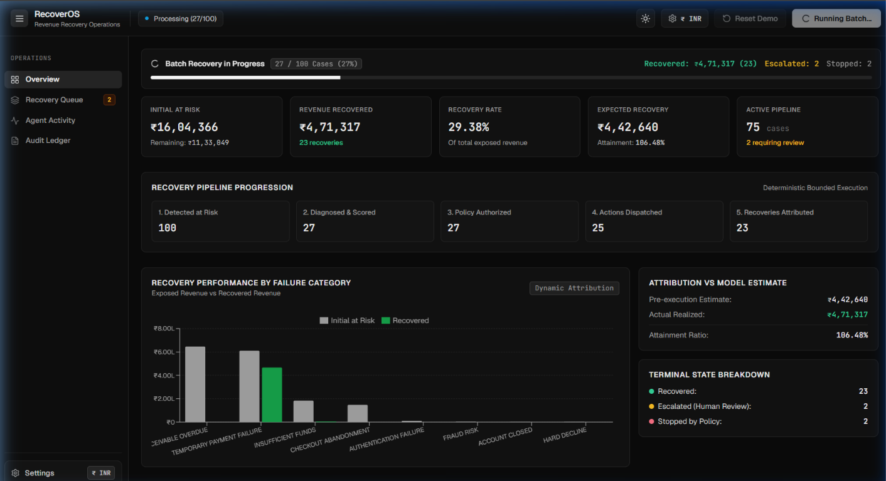

---

### D. Batch Completed with simutlation
*Enterprise clean Dark mode with batch completed with simulation.*
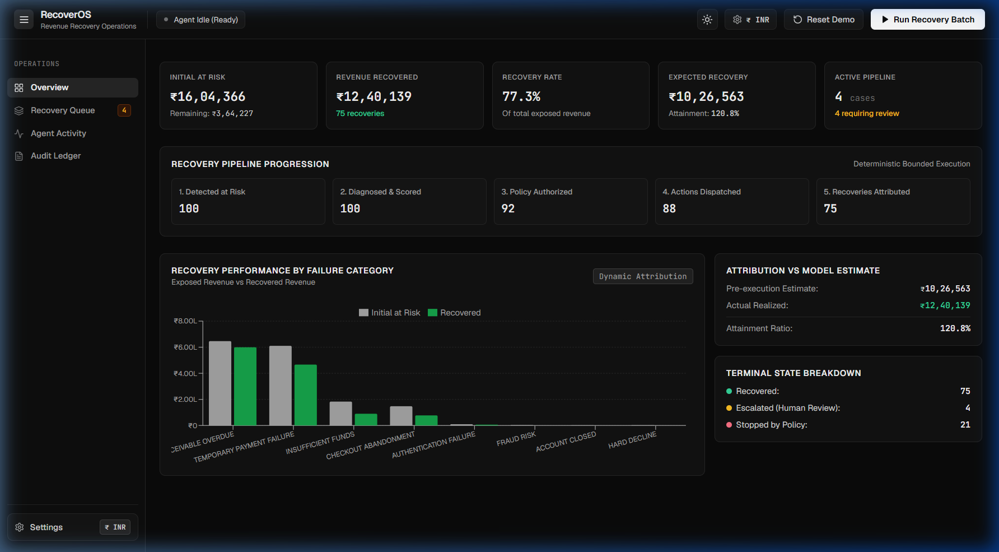

### E. Dense Recovery Queue Grid
*Real-time recovery queue with multi-state filters (All, At Risk, Escalated, Recovered, Stopped), ROS score pills, and quick actions.*
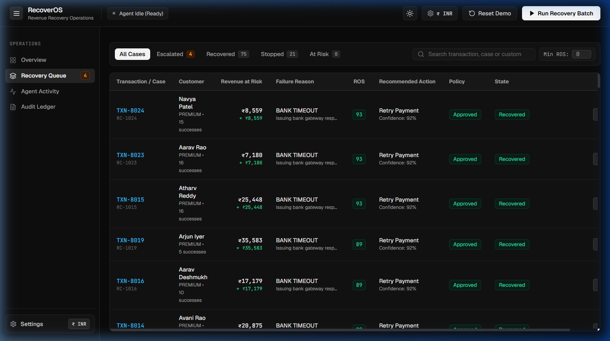

---

### F. Case Detail Investigation Drawer
*Comprehensive 4-tab case inspector showing AI root-cause analysis, customer timeline, mathematical scoring breakdown, and raw JSON payload.*
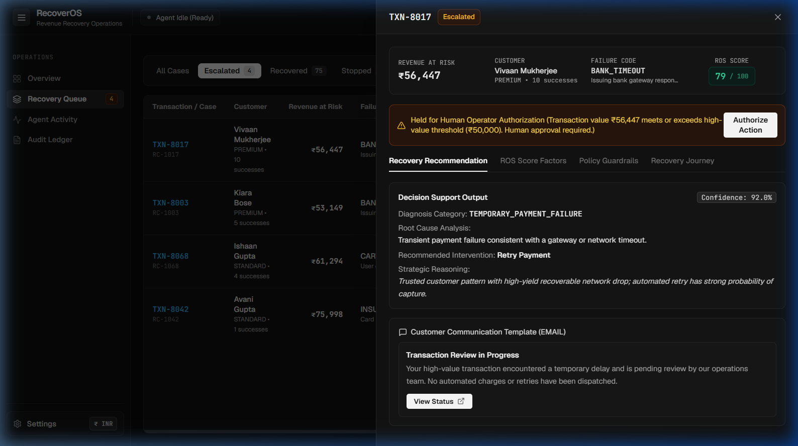

---

### G. Global Multi-Currency Conversion Engine
*Interactive Settings modal supporting 8 global currencies with live exchange rates and staged application.*
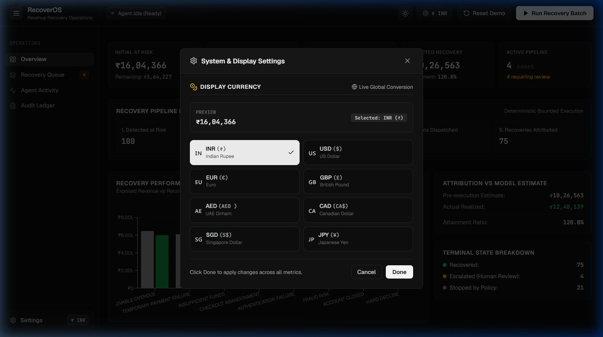

---

### H. High-Value Human Authorization Modal
*Human-in-the-loop governance modal allowing operators to authorize or reject high-exposure recoveries with operator attribution.*
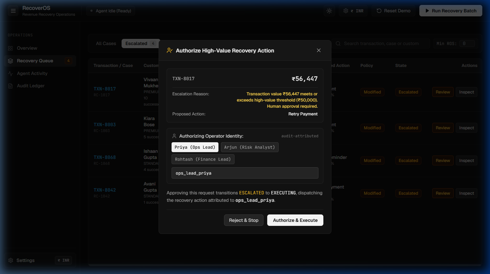

---

### I. Real-Time Agent Activity Stream
*Live operational feed breaking down AI diagnosis decisions, confidence meters, guardrail evaluations, and execution results.*
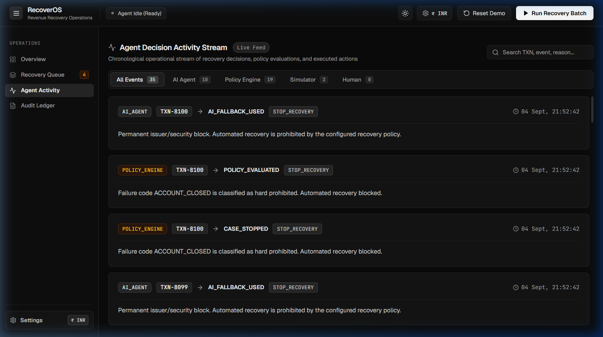

---

### J. Cryptographic Tamper-Evident Audit Ledger
*Append-only audit trail showing financial impact per transaction, actor badges, state payloads, and green SHA-256 chain verification.*
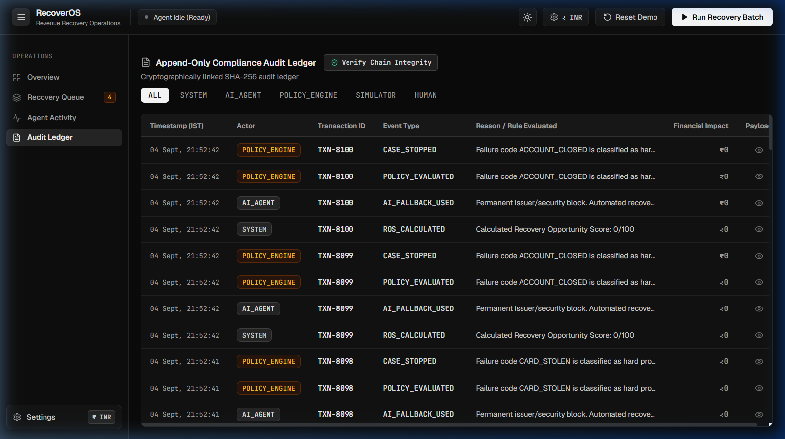
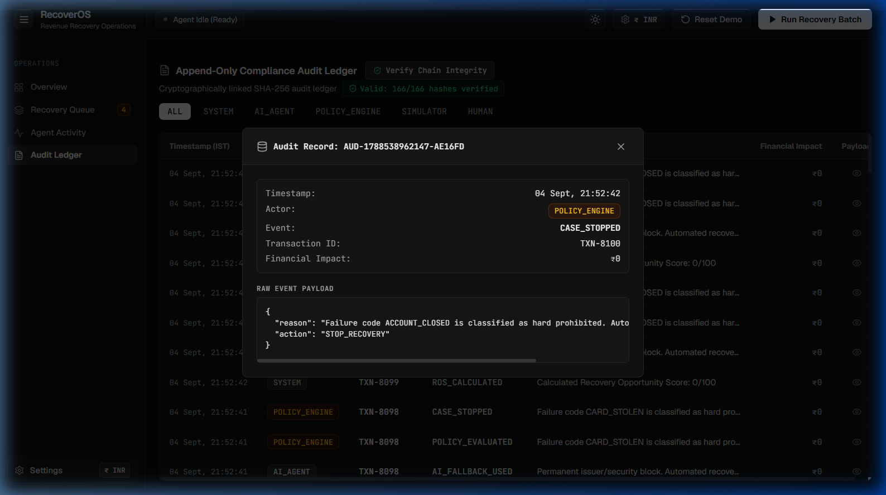

---

### K. Customer Experience & Payment Rails Modals
*Interactive customer payment confirmation, live delivery tracker, and alternate payment rails.*


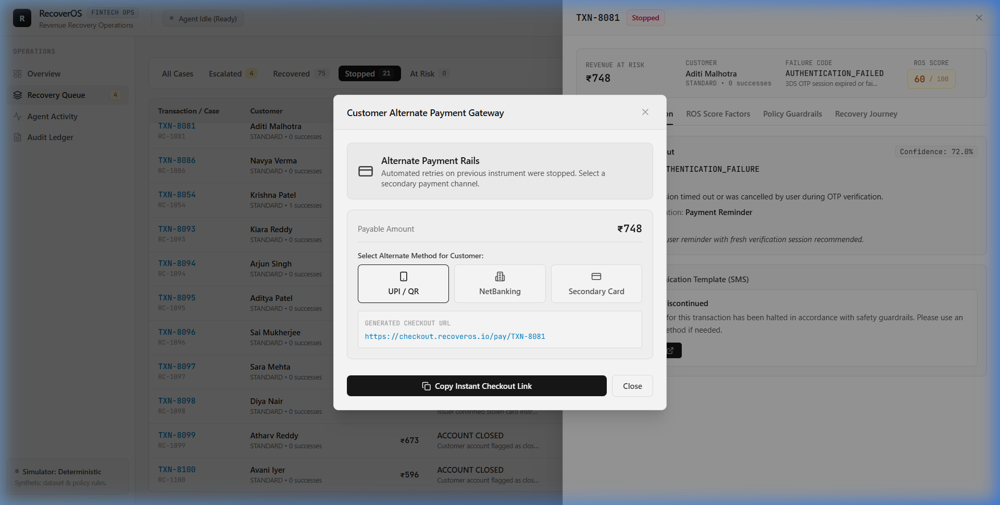


## 8. Mathematical Attribution & Demo Economics

All metrics on the dashboard are **dynamically computed directly from MongoDB collections**:

| Metric Name | Mathematical Formula | Business Definition |
| :--- | :--- | :--- |
| **Initial Revenue at Risk** | $\sum \text{initialRevenueAtRisk}$ | Total gross exposed revenue across all 100 cases |
| **Recovered Revenue** | $\sum \text{recoveredAmount} \text{ (where state = 'RECOVERED')}$ | Realized revenue saved by completed interventions |
| **Remaining Exposure** | $\text{Initial at Risk} - \text{Recovered Revenue}$ | Unrecovered revenue currently remaining |
| **Recovery Rate** | $\frac{\text{Recovered Revenue}}{\text{Initial Revenue at Risk}} \times 100$ | Percentage of exposed revenue successfully saved |
| **Expected Recovery** | $\sum (\text{initialRevenueAtRisk} \times \frac{\text{ROS}}{100})$ | Statistical expectation based on pre-execution ROS |
| **Recovery Attainment** | $\frac{\text{Recovered Revenue}}{\text{Expected Recovery}} \times 100$ | Ratio of realized revenue to heuristic expectation |

### Reference Calibrated Benchmark (100 Cases Dataset)
- **Initial Revenue at Risk**: **₹16,04,366** ($100$ cases)
- **Recovered Revenue**: **₹12,40,139** ($75$ cases recovered)
- **Recovery Rate**: **77.30%**
- **Expected Recovery**: **₹10,26,563**
- **Recovery Attainment**: **120.8%** *(realized revenue exceeded mathematical expectation)*
- **Escalated Cases (Held for Human)**: **4 cases** ($\ge \text{₹}50,000$)
- **Stopped Cases (Policy Blocked / Terminal)**: **21 cases** (Fraud / Closed Accounts / Expired SLAs)

---

## 9. Technology Stack

### Frontend
- **Framework**: React 18.3.1 (Vite 6.4.3 SPA)
- **Styling**: Tailwind CSS 3.4.17 (Custom neutral enterprise design tokens)
- **Typography**: Geist (Primary UI font) + JetBrains Mono (Financial amounts & transaction IDs)
- **Icons**: Lucide React 0.474.0
- **Data Visualization**: Recharts 2.15.0
- **HTTP Client**: Axios 1.7.9

### Backend & Core Services
- **Runtime**: Node.js v20+ / v24 (ES Modules)
- **API Framework**: Express.js 4.21.2
- **Database ODM**: Mongoose 8.9.5 (MongoDB with compound indexing `{ state: 1, recoveryScore: -1 }`)
- **Schema Validation**: Zod 3.24.1 (Inbound payload schemas & LLM response parsers)
- **Security & Rate Limiting**: express-rate-limit 7.5.0, Node.js `crypto` SHA-256 hash chaining
- **Testing**: Vitest 5.0.0 (Automated unit tests across scoring, policies, states, determinism, and idempotency)
- **Middleware**: CORS 2.8.5, Dotenv 16.4.7

### AI Intelligence & Simulation
- **LLM Integration**: xAI Grok (`grok-2-latest` REST API)
- **Fallback Engine**: Deterministic heuristic engine (offline-capable)
- **Simulator**: MD5 hash-based deterministic outcome resolver

---

## 10. Project Directory Structure

```
RecoverOS/
├── client/                               # Frontend Single Page Application
│   ├── src/
│   │   ├── components/
│   │   │   ├── activity/                 # Agent Activity Feed & LLM Reasoning Cards
│   │   │   ├── audit/                    # Audit Ledger & SHA-256 Hash Chain Verifier
│   │   │   ├── common/                   # SettingsModal, Badges, Modals, Drawers
│   │   │   ├── dashboard/                # KPI Cards, Recovery Funnel, Recharts Visuals
│   │   │   ├── detail/                   # Case Detail Inspector & Scoring Breakdown
│   │   │   ├── layout/                   # Responsive AppShell, TopHeader, Sidebar
│   │   │   └── queue/                    # Recovery Queue Grid, Filters, Action Modals
│   │   ├── context/                      # CurrencyContext (8 Global Currencies)
│   │   ├── api/                          # Axios API Client with x-api-key support
│   │   ├── utils/                        # Currency Formatters, Date Parsers, Badges
│   │   ├── App.jsx                       # Main Application Root & Tab Controller
│   │   └── index.css                     # Pure Tailwind Tokens & Typography Rules
│   ├── index.html                        # HTML5 Root with Geist Font Preloads
│   ├── tailwind.config.js                # Custom Color Tokens & Breakpoints
│   └── package.json
│
├── server/                               # Backend REST API
│   ├── src/
│   │   ├── config/                       # Database Connection, Env Config, Constants
│   │   ├── controllers/                  # Express REST Route Handlers
│   │   ├── middleware/                   # API Key Auth, Zod Validation, Rate Limiter
│   │   ├── models/                       # Mongoose Schemas (6 Indexed Collections)
│   │   ├── routes/                       # REST Route Definitions & In-Memory Metrics
│   │   ├── schemas/                      # Zod Request & Response Schemas
│   │   ├── scripts/                      # Seed Generators, Determinism Tests, QA Suites
│   │   └── services/
│   │       ├── ai/                       # Grok Agent, Prompt Builder, Fallback Engine
│   │       ├── analytics/                # Financial Attribution & 5s TTL Cache
│   │       ├── audit/                    # SHA-256 Hash Chained Audit Service & Verifier
│   │       ├── policy/                   # 7-Step Policy Precedence Engine
│   │       ├── scoring/                  # Opportunity Scorer (ROS 0–100 Algorithm)
│   │       ├── simulation/               # Batch Orchestrator & Deterministic Simulator
│   │       └── workflow/                 # State Machine & Idempotency Manager
│   ├── server.js                         # Express Server Entry Point
│   └── package.json
│
├── docs/
│   ├── screenshots/                      # High-Resolution Verification Screenshots
├── .env.example                          # Environment Variables Template
├── .gitignore                            # Exclusion Rules
├── README.md                             # Production Technical Documentation
└── package.json                          # Monorepo Orchestration Scripts
```

---

## 11. Local Setup & Reproduction Guide

### Prerequisites
- **Node.js**: v20.0.0 or higher
- **MongoDB**: Local MongoDB on `mongodb://127.0.0.1:27017` (or MongoDB Atlas connection string)
- **Package Manager**: `npm`

### Step 1: Clone Repository
```bash
git clone <repository-url>
cd RecoverOS
```

### Step 2: Install Dependencies
```bash
# Installs root, backend, and frontend dependencies
npm run install
```

### Step 3: Configure Environment
Create `server/.env` using `.env.example`:
```bash
cp .env.example server/.env
```

Edit `server/.env` if using live xAI Grok:
```env
PORT=5000
NODE_ENV=development
MONGO_URI=mongodb://127.0.0.1:27017/recoveros
GROK_API_KEY=your_xai_grok_api_key_here  # Optional: Leave blank to use FallbackEngine
GROK_MODEL=grok-2-latest
CLIENT_URL=http://localhost:5173
AI_TIMEOUT_MS=3500
AI_MODE=deterministic                   # 'live' or 'deterministic'
SIMULATION_SEED=RECOVEROS_BUILDATHON_2026
```

### Step 4: Run Automated Tests & Verification
```bash
# Run Vitest unit tests (23 tests across 5 suites)
npm test

# Run 2-pass determinism verification
npm run test:determinism
```

### Step 5: Start Development Servers
```bash
# Terminal 1: Backend Server (Port 5000)
npm run dev

# Terminal 2: Frontend Client (Port 5173)
npm run dev
```

Open your browser at: **`http://localhost:5173`**

---

## 12. Environment Configuration

| Variable | Description | Default / Example |
| :--- | :--- | :--- |
| `PORT` | Express backend listening port | `5000` |
| `NODE_ENV` | Application environment | `development` |
| `MONGO_URI` | MongoDB database URI | `mongodb://127.0.0.1:27017/recoveros` |
| `GROK_API_KEY` | xAI Grok API Key (for Live Mode) | `xai-...` (or blank for Fallback) |
| `GROK_MODEL` | xAI Model Identifier | `grok-2-latest` |
| `CLIENT_URL` | Allowed CORS origin | `http://localhost:5173` |
| `AI_TIMEOUT_MS` | Max latency ceiling before invoking fallback | `3500` |
| `AI_MODE` | AI Mode (`live` or `deterministic`) | `deterministic` |
| `SIMULATION_SEED` | Global seed string for deterministic simulator | `RECOVEROS_BUILDATHON_2026` |
| `API_KEY` | Backend API Key (bypassed in dev if blank) | `secret_api_key_xxx` |
| `VITE_API_BASE_URL` | Frontend API client base URL | `http://localhost:5000/api` |
| `VITE_API_KEY` | Frontend API Key sent via `x-api-key` | `secret_api_key_xxx` |

---

## 13. REST API Reference

### Health & Observability
- **`GET /api/health`**: Returns service status, active AI mode (`live` / `deterministic`), and server timestamp.
- **`GET /api/metrics`**: In-memory telemetry (uptime, total requests, status codes, average latency, memory consumption).

### Dashboard & Analytics
- **`GET /api/dashboard/summary`**: Returns dynamically computed financial rollups, funnel counts, expected vs. actual metrics, and category breakdown (cached with 5-second TTL).

### Recovery Case Management
- **`GET /api/recovery-cases`**: Paginated recovery cases with filters (`state`, `search`, `minScore`, `limit`). Utilizes compound index `{ state: 1, recoveryScore: -1 }`.
- **`GET /api/recovery-cases/:id`**: Full inspection detail for a case (customer profile, score factors, actions, timeline).
- **`GET /api/recovery-cases/:id/why-not-retry`**: Policy guardrail explainability endpoint explaining why retries were blocked.
- **`POST /api/recovery-cases/:id/action`**: Executes human authorization (`APPROVE_ESCALATION` / `REJECT_ESCALATION`), requiring `operatorId`.
- **`POST /api/recovery-cases/:id/analyze`**: Runs single-case diagnostic analysis and bounded workflow execution.

### Simulation Engine
- **`POST /api/simulation/batch-run`**: Triggers batch execution of all 100 cases (`mode: "ANIMATED"` or `"FAST"`).
- **`POST /api/simulation/batch/:batchId/resume`**: Resumes an interrupted batch from its last atomic per-case checkpoint.
- **`GET /api/simulation/batch/:batchId/status`**: Status polling endpoint for running simulation batches.
- **`POST /api/simulation/reset`**: Resets the entire MongoDB database to clean initial `AT_RISK` seed dataset.

### Audit & Activity Streams
- **`GET /api/audit-logs`**: Immutable audit logs with actor filtering (`ALL`, `AI_AGENT`, `POLICY_ENGINE`, `SIMULATOR`, `HUMAN`).
- **`GET /api/audit-logs/verify-chain`**: Cryptographically traverses and verifies the sequential SHA-256 hash chain.
- **`GET /api/audit-logs/activity`**: Chronological operational event feed for the Agent Activity Stream.

---


## 14. Security, Governance & Compliance

- **No Secret Defaults**: Production environments strictly enforce configured `API_KEY` headers without fallback bypasses.
- **Inbound Zod Validation**: All mutating endpoints enforce strict schemas returning standard 400 `VALIDATION_ERROR` payloads.
- **Multi-Tiered Rate Limiting**: Global 300 req/min and mutating 10 req/min limits safeguard against accidental retry flooding.
- **Synthetic Data Only**: All demo transactions, customer names, and IDs are synthetic. No real customer data or PII is stored.
- **No Cardholder Data (PAN/CVV)**: The schema stores only metadata (`paymentMethod: "CARD"`, `last4: "4242"`).
- **Backend Key Isolation**: `GROK_API_KEY` is strictly confined to the backend environment and never leaked to the client bundle.
- **Deterministic Bounded Retries**: The policy engine enforces hard ceilings (max 2 retries, max 2 messages, SLA windows) preventing infinite execution loops.
- **Idempotency Protection**: Every execution requires an idempotency key to prevent double execution or race conditions.

---

## 15. Automated Verification & Test Matrix

```bash
# Run the complete automated Vitest unit test suite (23 tests across 5 suites)
npm test

# Run the 2-pass determinism & guardrail verification suite
npm run test:determinism

# Run dedicated feature verification scripts
node server/src/scripts/verifyAuth.js             # P0-1: Auth & Attribution
node server/src/scripts/verifyValidation.js       # P0-2: Inbound Zod Schemas
node server/src/scripts/verifyAuditConcurrency.js # P0: Audit Hash-Chain Concurrency
node server/src/scripts/verifyBatchResume.js      # P1-4: Resumable Batches
node server/src/scripts/verifyRateLimit.js        # P1-5: Rate Limiting
node server/src/scripts/verifyReceivablesLane.js  # P1-6: B2B Invoices
node server/src/scripts/verifyHashChain.js        # P2-7: SHA-256 Hash Chain
node server/src/scripts/verifyMetrics.js          # P2-8: In-Memory Metrics
node server/src/scripts/verifyP3Performance.js    # P3-9 & P3-10: Index & Caching
```

### Verified Test Matrix:
- ✅ **23 Automated Unit Tests Passing**: Scoring bounds, 7-step policy precedence, state machine transitions, MD5 determinism, and idempotency locks.
- ✅ **Continuous Integration**: Automated test suite runs on every push and pull request via GitHub Actions (`.github/workflows/ci.yml`).
- ✅ **Audit Concurrency**: 50 simultaneous concurrent audit writes verified with 0 forks, unique monotonic sequencing, and unbroken SHA-256 hash chaining.
- ✅ **Pass 1 vs. Pass 2 Determinism**: 100% identical financial outcomes across consecutive seed runs.
- ✅ **Scenario 1 (Fraud Hard Stop)**: Prohibited fraud codes (`FRAUD_SUSPECTED`) are blocked with ₹0 recovered.
- ✅ **Scenario 2 (High-Value Escalation)**: Transactions $\ge \text{₹}50,000$ escalate to the human queue.
- ✅ **Scenario 3 (Human Authorization)**: Escalated cases transition to `RECOVERED` upon human approval.
- ✅ **Scenario 4 (Idempotency Lock)**: Duplicate requests are safely blocked from re-execution.
- ✅ **Production Build Verification**: `npm run build:client` compiles with 0 errors.

---

## 16. Future Roadmap

1. **Live Gateway Webhook Ingestion**: Real-time webhook ingestion for Razorpay, Stripe, and Adyen with sub-second risk scoring.
2. **Merchant Policy Studio**: Visual no-code rule builder allowing finance leads to customize threshold values, retry backoffs, and approval matrices.
3. **Adaptive Intervention Optimization**: Reinforcement learning model optimizing recovery intervention selection based on historical success rates per issuer.
4. **Multi-Rail Smart Routing**: Automatically re-route failed card payments to instant UPI collect requests, net banking, or WhatsApp payment links.

---

